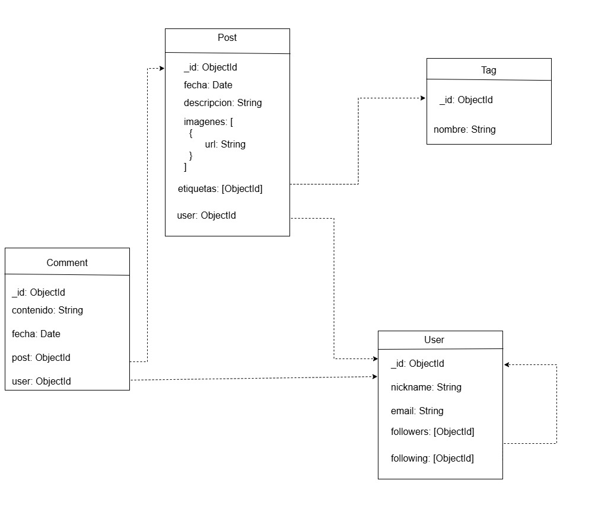

## CONSIGNA
e solicita el modelado y desarrollo de un sistema backend para una red social llamada **“UnaHur Anti-Social Net”**, inspirada en plataformas populares que permiten a los usuarios realizar publicaciones y recibir comentarios sobre las mismas.

# Contexto del Proyecto

En una primera reunión con los sponsors del proyecto, se definieron los siguientes requerimientos para el desarrollo de un **MVP (Producto Mínimo Viable)**:

- El sistema debe permitir que un usuario registrado realice una publicación (post), incluyendo **obligatoriamente una descripción**. De forma opcional, se podrán asociar **una o más imágenes** a dicha publicación.

- Las publicaciones pueden recibir **comentarios** por parte de otros usuarios.

- Las publicaciones pueden estar asociadas a **etiquetas (tags)**. Una misma etiqueta puede estar vinculada a múltiples publicaciones.

- Es importante que los **comentarios más antiguos que X meses** (valor configurable mediante variables de entorno, por ejemplo, 6 meses) **no se muestren** en la visualización de los posteos.

## IMPLEMENTACIÓN 
En este proyecto se nos solicitó modificar un trabajo práctico anterior, originalmente implementado con una base de datos relacional, y adaptarlo para su uso con una base de datos no relacional. En esta oportunidad, la implementación se realizó utilizando MongoDB y Docker, y además incorporamos Redis como valor agregado.

## MONGO DB
MongoDB es una base de datos NoSQL orientada a documentos, lo que significa que almacena datos en documentos flexibles en lugar de las tablas y filas tradicionales de las bases de datos relacionales. Funciona con un modelo de datos basado en documentos, similar a JSON, que permite almacenar datos estructurados, semiestructurados y no estructurados.

## DOCKER
Docker es una plataforma de código abierto que permite a los desarrolladores empaquetar aplicaciones y sus dependencias en contenedores, facilitando la creación, despliegue y ejecución de las mismas en diferentes entornos. Los contenedores son unidades estandarizadas que incluyen todo lo necesario para que la aplicación funcione, como código, bibliotecas y configuraciones del sistema, lo que garantiza la consistencia entre diferentes entornos

## REDIS
Redis es un almacén de datos en memoria, de código abierto, que se utiliza comúnmente como base de datos, caché o intermediario de mensajes. Es conocido por su alta velocidad y flexibilidad, lo que lo hace ideal para aplicaciones que requieren acceso rápido a los datos.

## Propósito general
Este proyecto es el backend de UnaHur Anti-Social Net, una red social minimalista desarrollada como MVP (Producto Mínimo Viable). Permite a los usuarios registrados realizar publicaciones, agregar imágenes, recibir comentarios y asociar etiquetas a sus posts. También se implementan funcionalidades sociales como el seguimiento entre usuarios y un sistema configurable para ocultar comentarios antiguos.

### Correr la App en desarrollo 

Instala las dependencias necesarias:
```bash
npm i
```

Inicializar entorno de desarrollo:
A. Crearse en raiz un .env 
B.copias allí el contenido de .env.example 
C.completar los campos vacios 

# Mongo DB 
USERNAME = se peude dejar en root, como se usa por defecto
PASSWORD = se peude dejar en example, como se usa por defecto

# Redis
PASSWORD = 1qaz!QAZ


### Dockerizar la app
Crea una imagen de la aplicación:
```bash
docker-compose up -d
```

Se podrá acceder al servicio de MongoDB: [http://localhost:808]
El puerto local de Redis es [http://localhost:5540]
Si se desea cambiar el PORT o algun otro valor se puede modificar el archivo .env

## API
 El la API el código esta organizado  en rutas, controllers y middlewares utilizando la separación por recurso. A continuación se detallan los endpoinds disponibles en la API.


2. **Uso de la API**:
   - Solicitudes HTTP a las rutas definidas para comments, post, postImage, tags, user:

|Verbo  |Recurso                    |Status code |Descripción
|-------|---------------------------|------------|-----------
| POST  | /comment                  |201         |Crear un nuevo comentario
| GET   | /comment                  |200         |Obtener todos los comentarios
| GET   | /comment/:id              |200         |Obtener un comentario de un ID determinado
| PUT   | /comment/:id              |200         |Modificar un comentario de un ID determinado 
| DELETE| /comment/:id              |200         |Eliminar un comentario de un ID determinado

| GET   | /post                     |200         |Obtener todos los posteos
| GET   | /post/:id                 |200         |Obtener un posteo de un ID determinado
| GET   | /post/:id/full            |200         |Obtener el usuario que realizó el posteo
| POST  | /post                     |201         |Crea un nuevo comentario
| PUT   | /post/:id                 |200         |Modificar un post de un ID determinado 
| DELETE| /post/:id                 |200         |Eliminar un post de un ID determinado
| POST  | /post/:id/tag             |200         |Asigna una etiqueta a un post
| DELETE| /post/:id/tag             |200         |Elimina una etiqueta de un post
| POST  | /post/:id/images          |200         |Sube una imagen
| DELETE| /post/:id/IMAGES          |200         |Elimina una imagen

| GET   | /postImage                |200         |Obtener todas las imágenes
| GET   | /postImage/:id            |200         |Obtener la imagen de un ID determinado
| POST  | /postImage                |201         |Crea un nueva imagen
| PUT   | /postImage/:id            |200         |Modificar un imagen de un ID determinado 
| DELETE| /postImage/:id            |200         |Eliminar un imagen de un ID determinado

| GET   | /tag                      |200         |Obtener todas las etiquetas
| GET   | /tag/:tagId/post          |200         |Obtener la etiqueta de un posteo de un ID determinado
| GET   | /tag/:id                  |200         |Obtener la etiqueta de un ID determinado
| POST  | /tag                      |201         |Crear una etiqueta
| PUT   | /tag/:id                  |200         |Modificar una etiqueta de un ID determinado 
| DELETE| /tag/:id                  |200         |Eliminar una etiqueta de un ID determinado

| GET   | /user                     |200         |Obtener todos los usuarios
| GET   | /user/:id                 |200         |Obtener un usuario de un ID determinado
| POST  | /user                     |201         |Crear un usuario
| PUT   | /user/:id                 |200         |Modificar un usuario de un ID determinado 
| DELETE| /user/:id                 |200, 500    |Eliminar un usuario de un ID determinado


## Modelo relacional del sistema 
 


